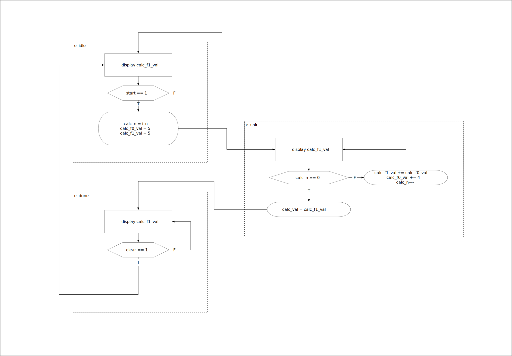
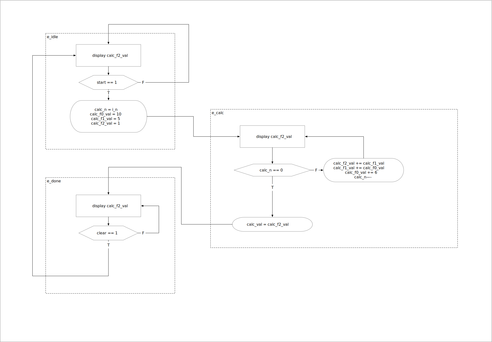
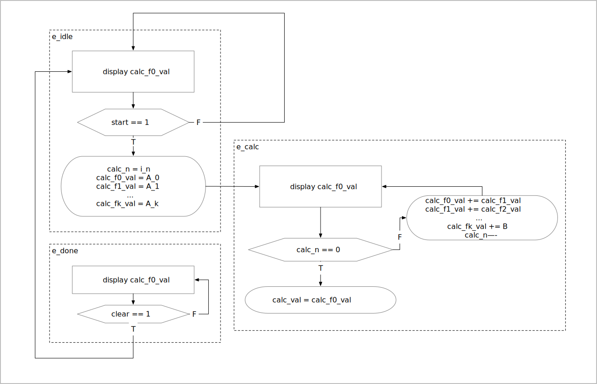

# 6.5.7 Babbage Difference Engine Emulation Circuit
## Prompt
1. Let $f(n)=2n^2+3n+5$. Derive the ASMD chart for a babbage difference engine tabulating $f(n)$, assuming that $n$ is a 6-bit unsigned integer input.
2. Derive the HDL code based on the ASMD chart.
3. Derive a testbench and simulate to verify operation of the code.
4. Synthesize the circuit, program the FPGA, and verify its operation.
5. Let $h(n)=n^3+2n^2+2n+1$. Use the method to find the recursive representation of $h(n)$, and repeat steps 1 to 4.
 
## Implementation for $f(n)=2n^2+3n+5$ (bab_2_3_5)
We calculate $f(n)-f(n-1)$ and get

$$
f(n) = \begin{cases}
    5 & \text{if } n = 0 \\
    f(n-1) + g(n) & \text{if } n > 0
\end{cases}
$$

Where $g(n)=4n+1$, we calculate $g(n)-f(n-1)$

$$
g(n) = \begin{cases}
    5 & \text{if } n = 1 \\
    g(n-1) + 4 & \text{if } n > 1
\end{cases}
$$

In this case, $f(n)=5+g(1)+g(2)+...+g(n)$, and $g(n)=4n+1$.

The implementation of this is shown below:

## Implementation for $f(n)=n^3+2n^2+2n+1$ (bab_1_2_2_1)
Likewise, we calculate $h(n)-h(n-1)$ to get

$$
h(n) = \begin{cases}
    1 & \text{if } n = 0 \\
    h(n-1) + j(n) & \text{if } n > 0
\end{cases}
$$

Where $j(n)=3x^2+x+1$, we calculate $j(n)-j(n-1)$ to get

$$
j(n) = \begin{cases}
    5 & \text{if } n = 1 \\
    j(n-1) + k(n) & \text{if } n > 1
\end{cases}
$$

Where $k(n)=6x-2$, we calculate $k(n)-k(n-1)$ to get

$$
k(n) = \begin{cases}
    10 & \text{if } n = 2 \\
    k(n-1) + 6 & \text{if } n > 2
\end{cases}
$$

For $h(n)$, we have $h(n)=1+j(1)+j(2)+...+j(n)=1+[5]+[5+k(2)]+...[5+k(2)+k(3)+...k(n)]$.

Using $n=3$ as an example, we have $h(3)=h(0)+j(1)+j(2)+j(3)=1+[5]+[5+k(2)]+[5+k(2)+k(3)]=1+[5]+[5+(10)]+[5+(10)+(6 + 10)]$

The implementation of this is shown below:

## General Implementation
For an order $k+1$ polynomial $f(n)$ that may be expressed as an array of functions $[g_0(n), g_1(n), ... , g_k(n)]$, where for $0 < i < (k - 1)$:

$$
g_i(n) = \begin{cases}
    A_i & \text{if } n = i \\
    g_i(n-1) + g_{(i+1)}(n) & \text{if } n > i
\end{cases}
$$

and

$$
g_k(n) = \begin{cases}
    A_k & \text{if } n = k \\
    g_k(n-1) + B & \text{if } n > k
\end{cases}
$$

then the ASMD implementation is as follows:

For example, with $f(n)=n^3+2n^2+2n+1$, we have
$$
g_0(n) = \begin{cases}
    1 & \text{if } n = 0 \\
    g_0(n-1) + g_1(n) & \text{if } n > 0
\end{cases}
$$

$$
g_1(n) = \begin{cases}
    5 & \text{if } n = 1 \\
    g_1(n-1) + g_2(n) & \text{if } n > 1
\end{cases}
$$

$$
g_2(n) = \begin{cases}
    10 & \text{if } n = 2 \\
    g_2(n-1) + 6 & \text{if } n > 2
\end{cases}
$$

So $A=[1,5,10]$ and $B=6$, which yields the state machine found in the previous section. Note that the ordering of the constituent functions in the previous section's implementation, and in the code, is reversed.

## Top Implementation
I use only the bab_2_3_5 variant due to limitations in the display. There is a "start" button linked to btnc and a "clear" button linked to btnu. A 6 bit $n$ can be selected through the switches on the board. Once the desired $n$ is selected, hit the start button, and the calculation will start. Once the calculation has finished, the clear button must be pressed before the circuit can calculate another value. 